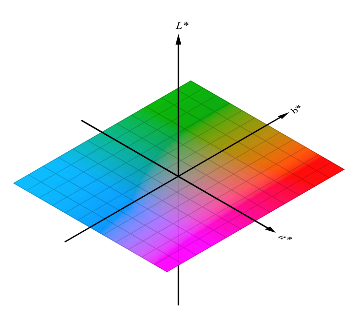
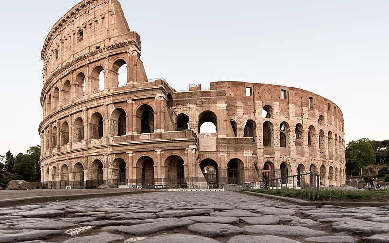
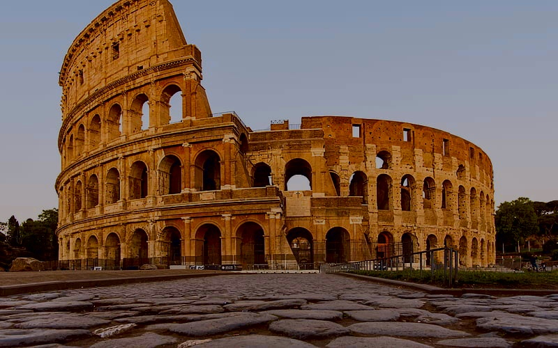

# Fast image color transfer

Image color transfer is a technique of transferring color texture of one image to another image.

# Description

## Lαβ color space
Lαβ color space is a **3-axis color system** 



* L represents lightness and α and β for the color dimensions. .
* Lαβ is the most exact representation or most **natural representation** of colors just like we humans see them.

This algorithm of color transfer was proposed in 
[Color Transfer between images]("https://www.cs.tau.ac.il/~turkel/imagepapers/ColorTransfer.pdf").

## Getting Started

### Dependencies 

* Dependencies are listed in requirements.txt

### Executing program

* Clone this repository

```
git clone https://github.com/Anant-mishra1729/Color-transfer.git
```
* Run python file color_transfer.py
```
python color_transfer.py 

--source or -s : Path to source image (Image to be used for transferring color)

--target or -t : Path to target image (Image on which color is transferred)

--result or -r : Path to resulting image
```

## Results
Images are taken from google images

<div align = "left">



</div>

<div align = "left">


</div>

## Contributors

* [Anant Mishra]("https://github.com/Anant-mishra1729")

## License

This project is licensed under the MIT License - see the LICENSE.md file for details

## Acknowledgments

* [Color Transfer between images]("https://www.cs.tau.ac.il/~turkel/imagepapers/ColorTransfer.pdf")