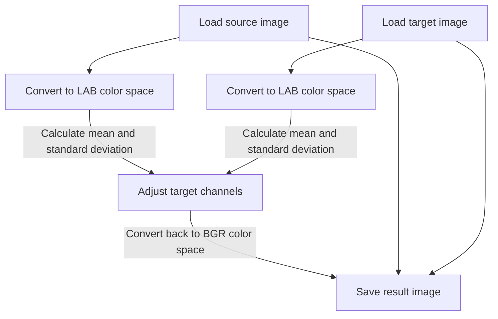
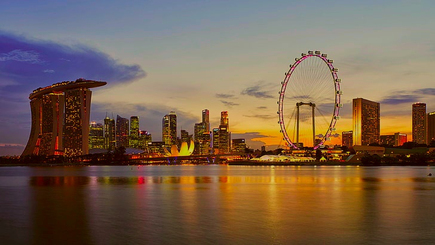
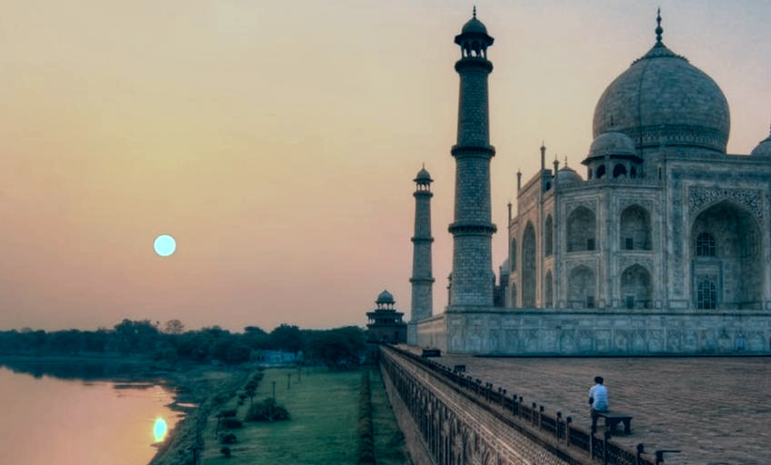

# Image color transfer

This Python program implements a color transfer algorithm that takes as input two images, a source image and a target image, and **applies the color distribution of the source image to the target image.** The program uses the OpenCV library to perform color space conversion and manipulation.

# Description
The color transfer algorithm works by computing the mean and standard deviation of the color channels in the LAB color space for both the source and target images. Then, it adjusts the color channels of the target image to match the mean and standard deviation of the corresponding channels in the source image. Finally, the program converts the resulting image back to the BGR color space and saves it to a file.




### Lab color space
The Lab* (or LAB) color space is used in this color transfer algorithm as it provides a perceptually uniform color space, meaning that the distances between colors in this space correspond to human perception of color differences. The Lab* color space separates the color information into three channels: L (lightness), a (green-red axis), and b (blue-yellow axis).


## Getting Started

### Dependencies 

* Dependencies are listed in requirements.txt

### Executing program

* Clone this repository

```
git clone https://github.com/Anant-mishra1729/Color-transfer.git
```
* Run python file color_transfer.py
```
python color_transfer.py 

--source or -s : Path to source image (Image to be used for transferring color)

--target or -t : Path to target image (Image on which color is transferred)

--result or -r : Path to resulting image
```

## Results
Source : Google images
|Source|Target|Result|
|---|---|---|
||||
||||
## Contributors

<a href="https://github.com/Anant-mishra1729">Anant Mishra</a>

## License

This project is licensed under the MIT License - see the LICENSE.md file for details

## Acknowledgments
<a href="https://www.cs.tau.ac.il/~turkel/imagepapers/ColorTransfer.pdf">Color Transfer between images</a>
